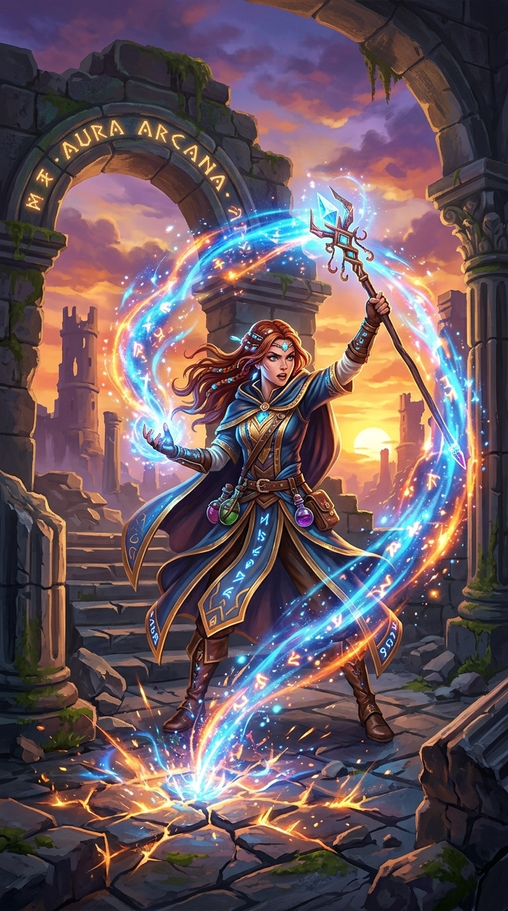

# Prompt iteration: mobile RPG key art

*Work in progress — rounds 2 and 3 to come.*

A short record of how I work a text-to-image prompt from a vague first attempt to something that actually matches a brief. I picked a mobile game key art brief because it has real constraints: it has to read at thumbnail size, and it has to look like a store asset rather than generic fantasy art. Each round shows the prompt, what came back, what was wrong with it, and what I changed to fix it.

Generated in Gemini (Flash, image tool). Prompt restructuring worked out in Claude.

## The brief

App store key art for a fantasy mobile RPG. A lone battle-mage at the edge of a crumbling ruin at dusk, mid-cast, energy forming in one outstretched hand. It has to read clearly at thumbnail size — strong silhouette, one obvious focal point, premium mobile game look rather than generic fantasy art.

## Round 1

**Prompt**

```
fantasy mage casting a spell in ruins at sunset, mobile game art
```



**What came back**

First thing I noticed: it's a pretty picture, but I can't find the mage in it. My eye keeps sliding off her. The blue swirl cuts right across her body, her cloak is the same murky grey-blue as the stone behind her, and there's no edge anywhere that says *this is the character*. I shrunk it down small on my phone to check and she basically disappears into the rubble.

The other problem is everything is glowing. The sunset, the swirl, the crystal on the staff, the cracks in the ground, the little runes, even the potion bottles on her belt. So nothing wins. My eye bounces around the frame and never lands. I asked for the magic to be in her hand, and instead it's a big ring wrapped around her whole body, which spreads it out even more.

Then there's the text on the arch. I never asked for text. It says something like "AURA ARCANA" with a couple of made-up letters mixed in. That alone kills it as an actual store asset.

The background is doing way too much — two arches, moss, stairs, broken towers in the distance, full sunset. Nothing sits back. She's got nothing to stand out against.

And it's flat. There's no real dark anywhere in the picture. Everything is mid-brightness, evenly lit, which is why it feels like generic asset-store art instead of something you'd actually see on a store page.

Colours are fighting too — purple sky, orange sun, blue magic, green moss. Four things at once.

Small stuff: her outstretched hand is a bit mushy up close, and the whole thing came out tall and poster-shaped, which wasn't a decision I made.

## Round 2

*(to come)*

## Round 3

*(to come)*

## What I learned

*(to come)*
