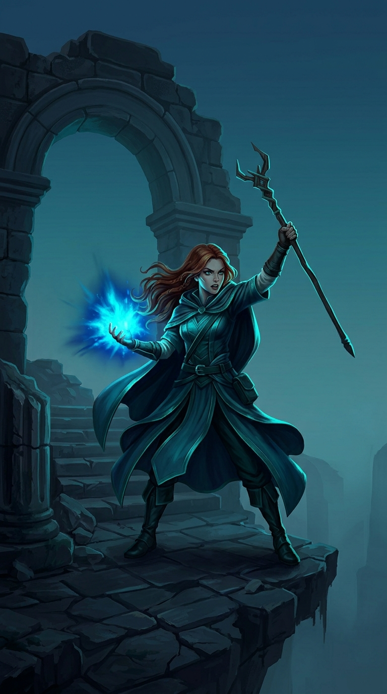
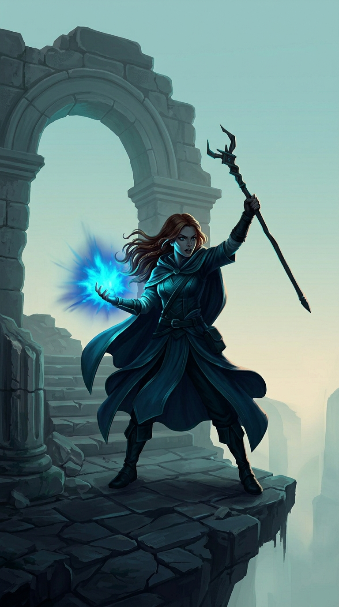
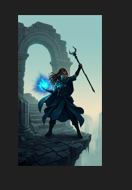
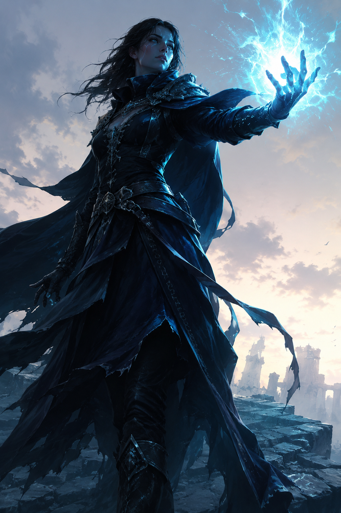
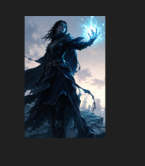

# Prompt iteration: mobile RPG key art

A short record of how I work a text-to-image prompt from a vague first attempt to something that actually matches a brief. I picked a mobile game key art brief because it has real constraints: it has to read at thumbnail size, and it has to look like a store asset rather than generic fantasy art. Each round shows the prompt, what came back, what was wrong with it, and what I changed to fix it.

Generated in Gemini (Flash 3.6, Nano Banana 2), with a cross-model check in ChatGPT. Prompt restructuring worked out in Claude.

## The brief

App store key art for a fantasy mobile RPG. A lone battle-mage at the edge of a crumbling ruin at dusk, mid-cast, energy forming in one outstretched hand. It has to read clearly at thumbnail size: strong silhouette, one obvious focal point, premium mobile game look rather than generic fantasy art.

## Round 1

**Prompt**

```
fantasy mage casting a spell in ruins at sunset, mobile game art
```


**What came back**

The thing I expected to fail was the thumbnail read, so I checked that first. I zoomed out until it was roughly icon-sized and it held up better than I thought it would. The glowing ring wrapped around her actually helps at that size. It marks where she is even when the detail is gone. So the silhouette is not the problem here, which surprised me.

What is a problem is that everything is glowing. The sunset, the swirl, the crystal on the staff, the cracks in the ground, the little runes, even the potion bottles on her belt. At full size nothing wins. My eye bounces around the frame and never lands. I asked for the magic to be in her hand, and instead it's a big ring wrapped around her whole body, which spreads it out even more.

Then there's the text on the arch. I never asked for text. It says something like "AURA ARCANA" with a couple of made-up letters mixed in. That alone kills it as an actual store asset.

The background is doing way too much. Two arches, moss, stairs, broken towers in the distance, full sunset. Nothing sits back.

And it's flat. There's no real dark anywhere in the picture. Everything is mid-brightness, evenly lit, which is why it feels like generic asset-store art instead of something you'd actually see on a store page.

Colours are fighting too. Purple sky, orange sun, blue magic, green moss. Four things at once.

Small stuff: her outstretched hand is a bit mushy up close, and the whole thing came out tall and poster-shaped, which wasn't a decision I made.

## Round 2

Round 1 had three things I wanted to fix: the invented text on the arch, the cluttered background, and the flatness. I also wanted the magic concentrated in her hand instead of wrapped around her whole body.

**Prompt**

```
Key art for a premium mobile fantasy RPG. A lone battle-mage stands at the
crumbling edge of a ruined stone platform at dusk, seen in a low-angle
three-quarter medium shot, mid-cast, with a single concentrated burst of blue
arcane energy igniting in one outstretched hand. Strong readable silhouette:
the figure is clearly separated from the background, dark cloak against an open
twilight sky, with nothing crossing or overlapping the body. The spell in the
hand is the only bright light source, casting hard rim light along the figure's
edge; deep shadows elsewhere with true blacks. Uncluttered background, with the
ruin falling off into atmospheric haze, minimal detail, no secondary structures
or distant towers. Restrained palette: deep teal and indigo, with the spell's
warm cyan as the single accent. Painterly semi-realistic rendering, high
contrast, cinematic, designed to read clearly at thumbnail size. No text, no
lettering, no runes, no glowing ground cracks, no distorted hands.
```

**The model's disclaimer**

Before showing the image, Gemini told me it had been unable to leave out the lettering on the archway, the glowing runes on the ground, or the background structures. Then it generated an image where the lettering and the runes are gone. The self-report was wrong. It was right about the background, which still has the arch and the stairs in it, but wrong about the other two. Worth remembering that what the model says about its own output is not evidence of what it did.



**What came back**

The text is gone, which was the thing that made round 1 unusable. The arch is plain stone now. The ground runes are gone too.

The colours stopped fighting. It's teal and indigo with the cyan spell as the only accent, and it holds together as one image instead of four things competing.

The magic is a single burst in her hand instead of a ring around her body, so there's one clear place for your eye to land.

There's actual darkness in it now. Deep shadow in the arch, under the stairs, in the folds of her cloak. That's most of why it stopped looking like stock fantasy art.

What didn't work: the background is still busy. The arch is there, the stairs are there, and there's more structure in the haze on the right. I asked for none of that.

The framing instruction barely registered. I asked for a low-angle three-quarter medium shot. The angle is slightly lower than round 1, but it's still a tall full-body poster rather than the tighter framing I wanted.

The rim light is too subtle. There's a bit on her left arm and her hair, but her right side has almost nothing separating her from the background.

**The trade-off I didn't see coming**

I zoomed this one out to thumbnail size the same way I checked round 1, and it reads worse. Everything now sits in the same narrow band of dark teal, so at small sizes the figure and the background merge into one dark mass. Round 1 was ugly and cluttered but its bright sunset gave her something to stand against.

So fixing the clutter and the colour fight cost me the one thing the naive prompt was doing right, by accident. That's what round 3 has to reconcile.

## Round 3

The problem to solve was the one round 2 created. Everything was sitting in the same dark value range, so at small sizes the figure and the background merged. The fix I went with was putting a pale sky behind her, which is what round 1 was doing by accident with its bright sunset.

**Prompt**

```
Generate an image. Key art for a premium mobile fantasy RPG. A lone battle-mage
stands at the crumbling edge of a ruined stone platform at dusk, low camera
angle, framed from the knees up so the figure fills most of the frame. She is
mid-cast, with a bright concentrated burst of cyan arcane energy in one
outstretched hand. Behind her is a pale luminous twilight sky, bright enough
that her dark cloaked figure reads as a clean dark shape against it. Strong
value contrast between the dark figure and the light sky. The spell casts hard
cyan rim light along her face, shoulder and arm. The ruined stone is a
mid-value grey-teal, kept simple, its far edge dissolving into pale haze.
Restrained palette of deep teal and indigo against a light sky, with the cyan
spell as the single bright accent. Painterly semi-realistic rendering, high
contrast, cinematic, strong light-dark separation.
```



**What came back**

The pale sky worked. Her dark cloak now reads as a clean dark shape against a light background, which is the separation round 2 lost. The palette is still restrained teal and indigo, but there's a light to dark range across the frame now instead of one murky band.

The rim light on her hair and the edge of her cloak is stronger than round 2, and the spell still holds as the single bright accent.

**Thumbnail test**



It holds. The figure is unmistakably a person, the eye goes to the cyan burst first and then to her.

Round 1 also survived this test, but for a different reason. There the glowing ring marked where she was. Here it's the value contrast doing the work, which is the more reliable version of the same thing.

Two problems are still visible at this size. The arch takes up about as much visual weight as she does, so the eye reads it as a second shape competing with her. And she's small in the frame, which is the cost of the framing instruction failing.

**What didn't work, three times running**

The framing never landed. I asked for a low-angle three-quarter medium shot in round 2 and framed from the knees up so the figure fills most of the frame in round 3. Both times I got a tall full-body poster. Three attempts, three different phrasings, same result. Composition instructions written as prose don't reliably control framing in this model, and aspect ratio is usually a separate setting rather than something you describe in words.

The background also never cleared. I tried removing it with negatives in round 2 and with positive descriptions in round 3. The arch, the stairs and the cliff are in all three images. The model seems to want a compositional frame behind the subject whatever you tell it.

Minor: the stone went lighter than the mid-value grey-teal I asked for and reads almost white in places, which flattens the ruin a bit.

## Where it ended up

Round 3 is close to the brief. The thumbnail read works, there's one clear focal point, the palette holds together, and it looks like a game asset rather than stock fantasy art. What it isn't is the tighter composition I asked for, and that gap survived every attempt to fix it.

## Same prompt, different model

I ran the round 3 prompt through ChatGPT unchanged, to see how much of what I was getting was the prompt and how much was the model.



The framing landed immediately. Low angle, figure filling the frame, looking up at her from below. That is the instruction Gemini ignored three times across three different phrasings. Same words, different model, and it worked first try. So it was never a phrasing problem. It was a model limitation, and I had spent two rounds trying to fix it from the wrong end.

The background also mostly cleared. There are distant ruins on the right but nothing framing her the way Gemini's arch did in every single round.

Some things went the other way. The spell came out as a large diffuse crackling field rather than the contained burst I asked for, and Gemini's tighter orb was closer to the brief. The palette drifted too. I specified teal and indigo and got mostly blue and grey against a warm sky, where Gemini held the colours better. The style register is different as well: ChatGPT read "painterly semi-realistic" as tight digital concept art, Gemini read it as something flatter and more stylised. Neither is wrong, they just interpret the same words differently.

**Thumbnail test**



She dominates the frame here in a way the Gemini version doesn't, which is the payoff from the framing working. The spell still reads as a clear bright point.

But the bottom third goes muddy. Her lower half, the tattered cloak and the dark ruins merge into one indistinct mass, so you lose where she ends and the ground starts. Gemini's lighter stone platform kept that separation. The silhouette is noisier overall too, because the ragged fabric edges break up the outline that Gemini's clean cloak shape kept crisp.

So it isn't that one model is better. ChatGPT got the composition right and the value separation wrong at the bottom. Gemini got the palette and the silhouette clean but never gave me the framing. A finished asset would want ChatGPT's framing with Gemini's lower-half clarity.

## What I learned

The most useful thing was that fixing one problem broke another. Round 2 solved the clutter and the colour fight and cost me the thumbnail read, because the naive prompt in round 1 was accidentally doing something right that I hadn't noticed until it was gone. Fixes have costs, and you only find them by testing against the brief each time rather than just looking at whether the image improved.

The model's account of its own output is not evidence. In round 2 Gemini told me it had been unable to leave out the archway lettering and the ground runes, then produced an image with neither. It was right about the background and wrong about the rest. Check the image, not the caption.

Some instructions take and some don't, and the difference isn't about how clearly you phrase them. Lighting, palette and value contrast all responded well to plain description. Framing and background removal failed every time regardless of phrasing, including when I switched from negatives to positive descriptions. Knowing which category an instruction falls into saves rounds.

The clearest lesson came from running the same prompt through a second model. The framing instruction Gemini ignored three times worked in ChatGPT on the first attempt, unchanged. I had assumed I was phrasing it badly and spent two rounds rewording it. If an instruction fails repeatedly, testing it somewhere else is faster than rewriting it again, because it tells you whether the problem is the prompt or the tool.

Negatives are unreliable but not useless. "No text" did remove the invented lettering, even though the model said it couldn't. It's worth trying and worth verifying.
